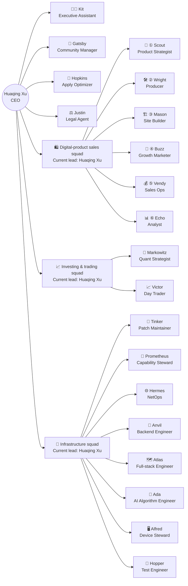

🌐 **English** | [简体中文](README_cn.md)

<h1>Hi there 👋 I'm Huaqing Xu</h1>

<h3>Building an AI Agent organizational structure & Open-source AI Agent team capabilities</h3>

<em>ML · Data Science · Quant Trading · Agentic Trading · Digital Products · Blockchain</em>

🇭🇰 **Hong Kong** &nbsp;·&nbsp; 🐍 **Pythonista** &nbsp;·&nbsp; ❤️ **Open Source & Geek mindset**

&nbsp;

&nbsp;

---

## 🚀 Flagship Project

**An open-source multi-agent organization: 20 specialized agents — three business squads plus four direct reports — all led directly by Huaqing Xu.**

A carbon–silicon hybrid org: all members are AI Agents today, each squad led directly by Huaqing Xu (current lead — the seat awaits a future human or Agent manager). The org is designed to onboard humans as it grows.

**The full org chart** (CEO → four direct reports + three squads · 20 specialized agents):

Solid arrows = reporting lines · Repo links for every member in the roster table below.

<table align="center">
  <tr><th>AI Agent</th><th>Role</th><th>Repo</th><th>Visits/day (14d)</th></tr>
  <tr><td colspan="4"><b>👔 Direct reports to the owner — not in any squad</b></td></tr>
  <tr><td>👩‍💼 <b>Kit</b></td><td>Executive Assistant</td><td><a href="https://github.com/xhqing/ExecutiveAssistantAgent">ExecutiveAssistantAgent</a></td><td></td></tr>
  <tr><td>🥂 <b>Gatsby</b></td><td>Community Manager</td><td><a href="https://github.com/xhqing/CommunityManagerAgent">CommunityManagerAgent</a></td><td>—</td></tr>
  <tr><td>🎯 <b>Hopkins</b></td><td>Apply Optimizer</td><td><a href="https://github.com/xhqing/ApplyOptimizerAgent">ApplyOptimizerAgent</a></td><td>—</td></tr>
  <tr><td>⚖️ <b>Justin</b></td><td>Legal Agent</td><td><a href="https://github.com/xhqing/LegalAgent">LegalAgent</a></td><td>—</td></tr>
  <tr><td colspan="4"><b>🛍️ Digital-product sales squad — pipeline: research → produce → build → traffic → sell → analyze</b></td></tr>
  <tr><td>🧭 <b>Scout</b></td><td>Product Strategist</td><td><a href="https://github.com/xhqing/ProductStrategistAgent">ProductStrategistAgent</a></td><td></td></tr>
  <tr><td>🛠️ <b>Wright</b></td><td>Producer</td><td><a href="https://github.com/xhqing/ProductProducerAgent">ProductProducerAgent</a></td><td></td></tr>
  <tr><td>🏗️ <b>Mason</b></td><td>Site Builder</td><td><a href="https://github.com/xhqing/SiteBuilderAgent">SiteBuilderAgent</a></td><td>—</td></tr>
  <tr><td>📣 <b>Buzz</b></td><td>Growth Marketer</td><td><a href="https://github.com/xhqing/GrowthMarketerAgent">GrowthMarketerAgent</a></td><td></td></tr>
  <tr><td>💰 <b>Vendy</b></td><td>Sales Ops</td><td><a href="https://github.com/xhqing/DigiVendAgent">DigiVendAgent</a></td><td></td></tr>
  <tr><td>📊 <b>Echo</b></td><td>Analyst</td><td><a href="https://github.com/xhqing/DataAnalystAgent">DataAnalystAgent</a></td><td></td></tr>
  <tr><td colspan="4"><b>📈 Investing &amp; trading squad — quant strategies &amp; day trading</b></td></tr>
  <tr><td>📈 <b>Victor</b></td><td>Day Trader</td><td><a href="https://github.com/xhqing/DayTradingAgent">DayTradingAgent</a></td><td></td></tr>
  <tr><td>📐 <b>Markowitz</b></td><td>Quant Strategist</td><td><a href="https://github.com/xhqing/QuantStrategistAgent">QuantStrategistAgent</a></td><td></td></tr>
  <tr><td colspan="4"><b>🧰 Infrastructure squad — shared foundations the whole team runs on</b></td></tr>
  <tr><td>🔧 <b>Tinker</b></td><td>Patch Maintainer</td><td><a href="https://github.com/xhqing/PatchClaudeAgent">PatchClaudeAgent</a></td><td></td></tr>
  <tr><td>🧰 <b>Prometheus</b></td><td>Capability Steward</td><td><a href="https://github.com/xhqing/CapabilityManagerAgent">CapabilityManagerAgent</a></td><td></td></tr>
  <tr><td>🌐 <b>Hermes</b></td><td>NetOps Engineer</td><td><a href="https://github.com/xhqing/NetOpsAgent">NetOpsAgent</a></td><td></td></tr>
  <tr><td>🔨 <b>Anvil</b></td><td>Backend Engineer</td><td><a href="https://github.com/xhqing/BackendEngineerAgent">BackendEngineerAgent</a></td><td></td></tr>
  <tr><td>🗺️ <b>Atlas</b></td><td>Full-stack Engineer</td><td><a href="https://github.com/xhqing/FullStackEngineerAgent">FullStackEngineerAgent</a></td><td></td></tr>
  <tr><td>🧠 <b>Ada</b></td><td>AI Algorithm Engineer</td><td><a href="https://github.com/xhqing/NeuralCoreAgent">NeuralCoreAgent</a></td><td>—</td></tr>
  <tr><td>🖥️ <b>Alfred</b></td><td>Device Steward</td><td><a href="https://github.com/xhqing/DeviceStewardAgent">DeviceStewardAgent</a></td><td></td></tr>
  <tr><td>🐞 <b>Hopper</b></td><td>Test Engineer</td><td><a href="https://github.com/xhqing/TestEngineerAgent">TestEngineerAgent</a></td><td></td></tr>
</table>

The team is organized into three squads by domain, with four direct reports outside them all:

- **👩‍💼 Kit (Executive Assistant) — direct report, not in any squad.** The owner's first assistant and the team's generalist: picks up and handles almost anything — not a deep specialist in a single domain, but a multi-skilled all-rounder who manages whatever comes along.
- **🥂 Gatsby (Community Manager) — direct report, not in any squad.** Runs the owner's own WeChat community "AI前沿跨界交流群" (an AI-frontier, cross-industry exchange group): ideas, rules, topic calendars and retrospectives come from the agent; the owner guides and executes. Private community only — public-channel marketing stays with Buzz.
- **🎯 Hopkins (Apply Optimizer) — direct report, not in any squad.** Owns the full work-intake loop: gig & job hunting, application engineering (proposals & résumés), funnel tracking (application → reply → talk / interview → win / offer), pricing & salary tests — making the applications convert.
- **⚖️ Justin (Legal Agent) — direct report, not in any squad, serving all squads cross-team.** Owns everything contracts-and-payments across the whole team: contract drafting, staged-payment design, due diligence, evidence chains, dispute response.
- **🛍️ Digital-product sales squad** — the six-stage pipeline (Scout → Wright → Mason → Buzz → Vendy → Echo) turns one-time work into recurring passive income — see the dedicated section below.
- **📈 Investing & trading squad** — **Markowitz** develops and backtests quant strategies; **Victor** is the day trader.
- **🧰 Infrastructure squad** — **Tinker** patches CC (Claude Code) after every extension upgrade; **Prometheus** open-sources the capabilities the whole team shares (global CLAUDE.md, skills, rules); **Hermes** handles networking; **Anvil** handles backend development; **Atlas** handles full-stack projects; **Ada** covers AI Agent algorithms and reasoning engines; **Alfred** manages device resources (local Mac / remote servers / cloud machines); **Hopper** guards every software project with a regression safety net — test cases written before development, CI red-light gate before merge.

---

### 🛍️ Digital-product sales squad: an artifact-relay pipeline

**Running an end-to-end digital-product business: research → produce → build → traffic → sell → analyze. 🔁** *A growing roster of single-purpose AI Agents; six of them form this artifact-relay pipeline, turning one-time work into recurring passive income.*

**How the pipeline hands off** — six AI Agents pass artifacts down the line:

1. 🧭 **Scout** sizes up trends, market, rivals and profit potential → an *Opportunity Report* (what to sell, to whom, at what price) → **Wright**.
2. 🛠️ **Wright** turns the report into a finished product — Prompt packs, templates, ebooks, assets → **Mason**.
3. 🏗️ **Mason** builds the storefront — independent site, landing pages, payment integration — and hands off ready-to-sell buy links → **Buzz**.
4. 📣 **Buzz** repackages it into channel-specific traffic content with buy links (X · IG · YouTube · RedNote · Zhihu · Bilibili, etc.) → **Vendy**.
5. 💰 **Vendy** lists, prices, fulfills and supports across storefronts, closing the sale → sales data → **Echo**.
6. 📊 **Echo** attributes results to decisions and folds lessons into a playbook → feeds back to whichever pipeline stage needs it · 🔁 closing the loop.

Pipeline: ① Scout → ② Wright → ③ Mason → ④ Buzz → ⑤ Vendy → ⑥ Echo

**AI Agent-owned subprojects** — focused projects the agents maintain alongside their main repos:

| AI Agent | Subproject | What it is |
|---|---|---|
| 👩‍💼 <b>Kit</b> | [xhqing](https://github.com/xhqing/xhqing) | this profile repo |
| 🖥️ <b>Alfred</b> | [ResourceMonitor](https://github.com/xhqing/ResourceMonitor) | whole-machine resource monitor with AI cleanup actions (VSCode extension) |
| 🔨 <b>Anvil</b> | [CC-BRIDGE](https://github.com/xhqing/CC-BRIDGE) | Claude Code upstream bridge framework (Node.js) |
| 🗺️ <b>Atlas</b> | [zcode-cli](https://github.com/xhqing/zcode-cli) | unofficial ZCode terminal client (Node.js / TypeScript, TUI) |
| 🗺️ <b>Atlas</b> | [zcode-vsce](https://github.com/xhqing/zcode-vsce) | unofficial ZCode VSCode extension client |
| 🌐 <b>Hermes</b> | [XPilot](https://github.com/xhqing/XPilot) | Xray-core proxy-node manager CLI (Python) |
| 🧠 <b>Ada</b> | [AgentCortex](https://github.com/xhqing/AgentCortex) | deep-reasoning engine rules (Infinite / Rapid / Incisive) |
| 📐 <b>Markowitz</b> | [gridtrader](https://github.com/xhqing/gridtrader) | grid-trading strategy development & backtesting (Python / backtrader) |

---

## ⚙️ How the org runs

The interesting part is not the roster — it's the machinery between the agents:

- **📦 Artifact handoff.** Work moves between agents as defined deliverables, not chat: Scout's *Opportunity Report* feeds Wright's product build, Mason's storefront hands Buzz ready-to-sell links, Vendy's sales data lands in Echo's attribution engine. Each agent owns an output contract; the pipeline is the sum of those contracts.
- **🧰 Shared capability layer.** One agent (Prometheus) stewards the capabilities every agent runs on — global skills, rules, and CLAUDE.md — from a single authoritative source, with an open-source mirror as the distribution channel. A fix lands once and ripples to all 20+ agents.
- **🧠 Reasoning as infrastructure.** Specialized reasoning-engine rules (Infinite / Rapid / Incisive, by Ada) plus an evaluation system sit under every agent's thinking — reasoning depth is treated as shared infrastructure, not per-agent improvisation.
- **🐞 Quality gates with separation of powers.** Development agents hold implementation rights, Hopper holds test-case definition rights, and CI holds the final say — developers can't bend test cases to fit their implementation, and "fix A, break B" gets stopped before merge, not after.
- **⚖️ Contracts & payments as a first-class function.** Justin structures staged payments, due diligence and evidence chains for anything the org sells or signs — the org treats legal/payment design as an engineering discipline, not an afterthought.

**By the numbers:** 20+ specialized agents · 3 business squads · 4 direct reports · 6 pipeline stages · 200+ public repositories.

---

## 🛠️ Tech & Focus

---

## 📬 Connect

&nbsp;

&nbsp;

&nbsp;

---

## 💖 Sponsor

If my open-source work helps you, consider sponsoring — this keeps me motivated to keep creating more and better AI Agents and other Projects.

  

⭐ Star the repos you like · 🔱 Watch the team grow

