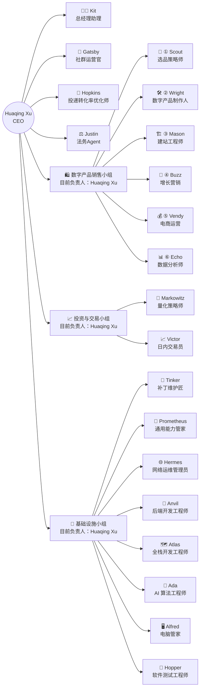

🌐 **简体中文** | [English](README.md)

<h1>你好 👋 我是 Huaqing Xu</h1>

<h3>打造智能体组织架构 · 开源智能体团队能力</h3>

<em>机器学习 · 数据科学 · 量化交易 · 智能体交易 · 数字产品 · 区块链</em>

🇭🇰 **香港** &nbsp;·&nbsp; 🐍 **Pythonista** &nbsp;·&nbsp; ❤️ **开源与极客精神**

&nbsp;

&nbsp;

---

## 🚀 旗舰项目

**一支开源的多智能体组织：20 个专岗 Agent，三个业务小组 + 四位直属成员，全员由 Huaqing Xu 直接领导。**

这是一套碳硅混合组织：目前全员为 AI Agent，各小组由 Huaqing Xu 直接负责（目前负责人——这个位置留给未来的人类或 Agent 管理者）。组织按未来吸纳人类成员的方向设计。

**完整组织架构**（CEO → 四位直属 + 三个小组 · 20 个专岗 Agent）：

实线箭头 = 汇报线 · 各成员仓库链接见下方名册表。

<table align="center">
  <tr><th>AI Agent</th><th>角色</th><th>仓库</th><th>近半月日均访问</th></tr>
  <tr><td colspan="4"><b>👔 直属用户 — 不属于任何小组</b></td></tr>
  <tr><td>👩‍💼 <b>Kit</b></td><td>总经理助理</td><td><a href="https://github.com/xhqing/ExecutiveAssistantAgent">ExecutiveAssistantAgent</a></td><td></td></tr>
  <tr><td>🥂 <b>Gatsby</b></td><td>社群运营官</td><td><a href="https://github.com/xhqing/CommunityManagerAgent">CommunityManagerAgent</a></td><td>—</td></tr>
  <tr><td>🎯 <b>Hopkins</b></td><td>投递转化率优化师</td><td><a href="https://github.com/xhqing/ApplyOptimizerAgent">ApplyOptimizerAgent</a></td><td>—</td></tr>
  <tr><td>⚖️ <b>Justin</b></td><td>法务Agent</td><td><a href="https://github.com/xhqing/LegalAgent">LegalAgent</a></td><td>—</td></tr>
  <tr><td colspan="4"><b>🛍️ 数字产品销售小组 — 流水线：研判 → 生产 → 建设 → 引流 → 成交 → 复盘</b></td></tr>
  <tr><td>🧭 <b>Scout</b></td><td>选品策略师</td><td><a href="https://github.com/xhqing/ProductStrategistAgent">ProductStrategistAgent</a></td><td></td></tr>
  <tr><td>🛠️ <b>Wright</b></td><td>数字产品制作人</td><td><a href="https://github.com/xhqing/ProductProducerAgent">ProductProducerAgent</a></td><td></td></tr>
  <tr><td>🏗️ <b>Mason</b></td><td>建站工程师</td><td><a href="https://github.com/xhqing/SiteBuilderAgent">SiteBuilderAgent</a></td><td>—</td></tr>
  <tr><td>📣 <b>Buzz</b></td><td>增长营销</td><td><a href="https://github.com/xhqing/GrowthMarketerAgent">GrowthMarketerAgent</a></td><td></td></tr>
  <tr><td>💰 <b>Vendy</b></td><td>电商运营</td><td><a href="https://github.com/xhqing/DigiVendAgent">DigiVendAgent</a></td><td></td></tr>
  <tr><td>📊 <b>Echo</b></td><td>数据分析师</td><td><a href="https://github.com/xhqing/DataAnalystAgent">DataAnalystAgent</a></td><td></td></tr>
  <tr><td colspan="4"><b>📈 投资与交易小组 — 从量化信号到实盘日内交易</b></td></tr>
  <tr><td>📈 <b>Victor</b></td><td>日内交易员</td><td><a href="https://github.com/xhqing/DayTradingAgent">DayTradingAgent</a></td><td></td></tr>
  <tr><td>📐 <b>Markowitz</b></td><td>量化策略师</td><td><a href="https://github.com/xhqing/QuantStrategistAgent">QuantStrategistAgent</a></td><td></td></tr>
  <tr><td colspan="4"><b>🧰 基础设施小组 — 全团队共同运行的共享底座</b></td></tr>
  <tr><td>🔧 <b>Tinker</b></td><td>补丁维护匠</td><td><a href="https://github.com/xhqing/PatchClaudeAgent">PatchClaudeAgent</a></td><td></td></tr>
  <tr><td>🧰 <b>Prometheus</b></td><td>通用能力管家</td><td><a href="https://github.com/xhqing/CapabilityManagerAgent">CapabilityManagerAgent</a></td><td></td></tr>
  <tr><td>🌐 <b>Hermes</b></td><td>网络运维管理员</td><td><a href="https://github.com/xhqing/NetOpsAgent">NetOpsAgent</a></td><td></td></tr>
  <tr><td>🔨 <b>Anvil</b></td><td>后端开发工程师</td><td><a href="https://github.com/xhqing/BackendEngineerAgent">BackendEngineerAgent</a></td><td></td></tr>
  <tr><td>🗺️ <b>Atlas</b></td><td>全栈开发工程师</td><td><a href="https://github.com/xhqing/FullStackEngineerAgent">FullStackEngineerAgent</a></td><td></td></tr>
  <tr><td>🧠 <b>Ada</b></td><td>AI 算法工程师</td><td><a href="https://github.com/xhqing/NeuralCoreAgent">NeuralCoreAgent</a></td><td>—</td></tr>
  <tr><td>🖥️ <b>Alfred</b></td><td>电脑管家</td><td><a href="https://github.com/xhqing/DeviceStewardAgent">DeviceStewardAgent</a></td><td></td></tr>
  <tr><td>🐞 <b>Hopper</b></td><td>软件测试工程师</td><td><a href="https://github.com/xhqing/TestEngineerAgent">TestEngineerAgent</a></td><td></td></tr>
</table>

整个团队按涉及领域分为三个小组，另有四位直属用户、不属任何小组：

- **👩‍💼 Kit（总经理助理）—— 直属用户，不属任何小组。**用户的第一助理、团队多面手：几乎任何事务都接得住、处理得了——不是某个领域的深度专家，而是什么都会、什么都能管。
- **🥂 Gatsby（社群运营官）—— 直属用户，不属任何小组**。运营用户自己的微信社群「AI前沿跨界交流群」：理念、群规、话题日历、复盘由智能体出，用户引导、执行。只做私域社群——公域投放仍归 Buzz。
- **🎯 Hopkins（投递转化率优化师）—— 直属用户，不属任何小组。**专门负责工作接单全链路：找单找岗、投递材料工程（标书 + 简历 + 打招呼话术）、漏斗追踪（投递 → 回应 → 沟通 / 面试 → 成单 / offer）、报价与薪资测试，让投出去的申请更多转化成单与 offer。
- **⚖️ Justin（法务Agent）—— 直属用户，不属任何小组，跨组服务全部小组。**负责整个团队所有跟合同和收款相关的事项：合同起草、分期收款设计、尽调、证据链、纠纷应对。
- **🛍️ 数字产品销售小组** —— 六段流水线（Scout → Wright → Mason → Buzz → Vendy → Echo）把一次性的产出变成持续到手的被动收入，详见下文。
- **📈 投资与交易小组** —— **Markowitz** 开发并回测量化策略；**Victor** 按标定后的信号做港股 / 美股实盘日内交易。
- **🧰 基础设施小组** —— **Tinker** 负责给 CC 打补丁；**Prometheus** 负责开源全团队共享的通用能力（全局 CLAUDE.md、skills、rules）；**Hermes** 负责网络问题；**Anvil** 负责后端开发；**Atlas** 负责全栈项目；**Ada** 负责 AI Agent 算法与推理引擎；**Alfred** 负责设备资源管理（本地电脑 / 远程服务器 / 云电脑）；**Hopper** 负责全团队软件项目的回归防护网——开发前先写验收测试用例、合并前 CI 红灯门禁，把「改 A 坏 B」拦在进主干之前。

---

### 🛍️ 数字产品销售小组：产物接力的六段流水线

**自主跑通数字产品全链路变现：选品 → 生产 → 建设 → 引流 → 成交 → 复盘。🔁** *一批不断壮大、各司其职的 AI Agents，其中六个组成这条产物接力的流水线，把一次性的产出变成持续到手的被动收入。*

**接力如何传递** —— 六个 AI Agent 沿流水线交接产物：

1. 🧭 **Scout** 研判热点、市场、竞品与盈利空间 →《机会研判报告》（卖什么、卖给谁、定什么价）→ **Wright**。
2. 🛠️ **Wright** 据报告做出成品数字产品——Prompt 包、模板、电子书、素材等 → **Mason**。
3. 🏗️ **Mason** 建成交阵地——独立站、落地页、支付链路，交出可成交的购买链接 → **Buzz**。
4. 📣 **Buzz** 包装成各渠道引流内容并附带货链接（X · IG · YouTube · 小红书 · 知乎 · B 站等）→ **Vendy**。
5. 💰 **Vendy** 上架、定价、履约、售后、多平台铺货，完成成交 → 销售数据 → **Echo**。
6. 📊 **Echo** 复盘归因，沉淀进 playbook → 反馈给流水线中相应环节 · 🔁 形成闭环。

流水线：① Scout → ② Wright → ③ Mason → ④ Buzz → ⑤ Vendy → ⑥ Echo

**AI Agent 负责的子项目** —— 各 Agent 在主仓库之外各自维护的专项项目：

| AI Agent | 子项目 | 是什么 |
|---|---|---|
| 👩‍💼 <b>Kit</b> | [xhqing](https://github.com/xhqing/xhqing) | 本个人主页仓库 |
| 🖥️ <b>Alfred</b> | [ResourceMonitor](https://github.com/xhqing/ResourceMonitor) | 整机资源监控 + AI 清理建议的 VSCode 扩展 |
| 🔨 <b>Anvil</b> | [CC-BRIDGE](https://github.com/xhqing/CC-BRIDGE) | Claude Code 上游桥接框架（Node.js） |
| 🗺️ <b>Atlas</b> | [zcode-cli](https://github.com/xhqing/zcode-cli) | 非官方 ZCode 终端客户端（Node.js / TypeScript，TUI） |
| 🗺️ <b>Atlas</b> | [zcode-vsce](https://github.com/xhqing/zcode-vsce) | 非官方 ZCode VSCode 扩展客户端 |
| 🌐 <b>Hermes</b> | [XPilot](https://github.com/xhqing/XPilot) | Xray-core 节点管理 CLI（Python） |
| 🧠 <b>Ada</b> | [AgentCortex](https://github.com/xhqing/AgentCortex) | 深度推理引擎规则集（Infinite / Rapid / Incisive） |
| 📐 <b>Markowitz</b> | [gridtrader](https://github.com/xhqing/gridtrader) | 网格交易策略开发及回测工具（Python / backtrader） |

---

## ⚙️ 组织怎么运转

有意思的不是名册本身，而是 agent 之间的运转机制：

- **📦 产物交接。** 工作以「定义清晰的交付物」在 agent 之间流转，不是聊天：Scout 的《机会研判报告》喂给 Wright 做产品，Mason 建成的阵地把可售链接交给 Buzz，Vendy 的销售数据进入 Echo 的归因引擎。每个 agent 拥有一份输出契约，流水线就是这些契约的总和。
- **🧰 共享能力层。** 由一个 agent（Prometheus）治理全员运行所依赖的能力——全局 skills、rules、CLAUDE.md——单一权威源 + 开源镜像作为分发出口。一处修复落地，涟漪扩散到全部 20+ 个 agent。
- **🧠 推理引擎作为基础设施。** 专用的推理引擎规则（Infinite / Rapid / Incisive，由 Ada 维护）加上评测体系，托底每一个 agent 的思考——推理深度被当作共享基础设施对待，而不是各 agent 各自即兴。
- **🐞 三权分立的质量门禁。** 开发 agent 持有实现权，Hopper 持有用例定义权，CI 持有裁决权——开发者不能为了让实现通过而改动用例，「改 A 坏 B」在合并前被拦下，而不是合并后。
- **⚖️ 合同与收款是一等职能。** Justin 为组织卖出或签署的每一笔交易设计分期收款、交易对手尽调和证据链——组织把法务与收款设计当作工程学科，而不是事后补救。

**数字一览：** 20+ 专岗 Agent · 3 个业务小组 · 4 位直属成员 · 6 段销售流水线 · 200+ 公开仓库。

---

## 🛠️ 技术栈

---

## 📬 联系我

&nbsp;

---

## 💖 赞助

如果我的开源工作帮到了你，欢迎赞助——这让我有动力持续创造更多更优质的 AI Agent 或其它 Project。

  

⭐ 给喜欢的仓库点 Star · 🔱 关注团队的壮大 · 🍻 用 ❤️ 与 Claude Code 构建

